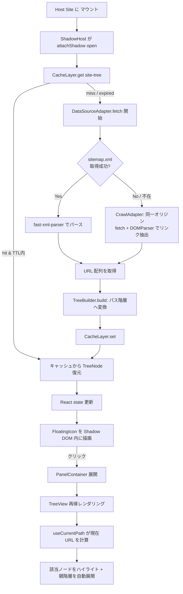
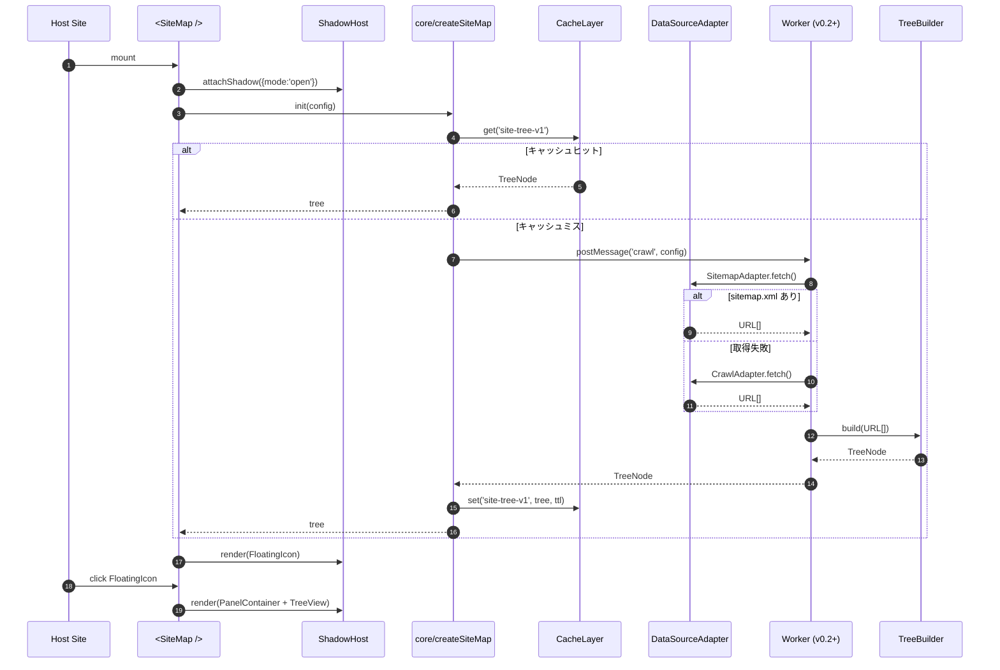
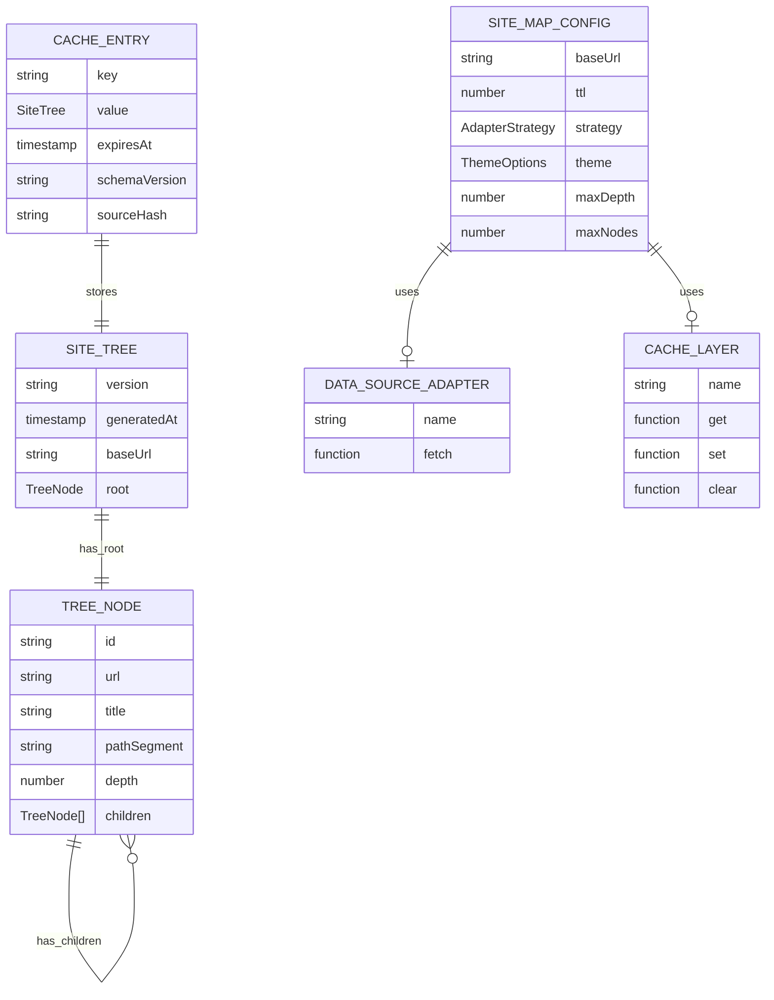
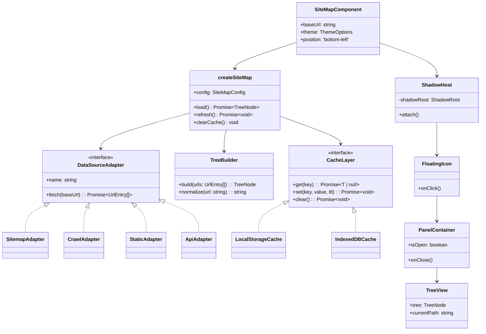

# Phase 2：アーキテクチャ設計フェーズ

> プロジェクト：**site-map**
> 作成日：2026-06-08
> ステータス：🟡 進行中（ユーザー合意待ち）

---

## 2-1. アーキテクチャ設計

### ディレクトリ構成（pnpm workspace モノレポ）

```
site-map/
├── packages/
│   ├── core/                          # @site-map/core（vanilla TS、フレームワーク非依存）
│   │   ├── src/
│   │   │   ├── adapters/              # データソース抽象（差し替え可能）
│   │   │   │   ├── index.ts           # interface DataSourceAdapter
│   │   │   │   ├── sitemap.ts         # SitemapAdapter（sitemap.xml fetch + パース）
│   │   │   │   ├── crawl.ts           # CrawlAdapter（同一オリジン内部リンク巡回）
│   │   │   │   ├── static.ts          # StaticAdapter（ユーザー提供 JSON）
│   │   │   │   └── api.ts             # ApiAdapter（v1.0、ホスト型 API）
│   │   │   ├── builders/
│   │   │   │   ├── treeBuilder.ts     # URL 配列 → TreeNode ルート構築
│   │   │   │   └── pathUtils.ts       # URL パス分解・正規化
│   │   │   ├── cache/
│   │   │   │   ├── index.ts           # interface CacheLayer
│   │   │   │   ├── localStorage.ts    # LocalStorageCache（v0.1）
│   │   │   │   └── indexedDb.ts       # IndexedDBCache（v0.2、idb）
│   │   │   ├── workers/
│   │   │   │   └── crawler.worker.ts  # Web Worker エンドポイント（v0.2、Comlink）
│   │   │   ├── types.ts               # 共通型定義（TreeNode, SiteMapConfig 等）
│   │   │   ├── createSiteMap.ts       # vanilla エントリ（adapter + cache を組み立て）
│   │   │   └── index.ts               # 公開 API
│   │   ├── tsup.config.ts
│   │   └── package.json
│   │
│   ├── react/                         # @site-map/react
│   │   ├── src/
│   │   │   ├── components/
│   │   │   │   ├── SiteMap.tsx        # 公開コンポーネント（ShadowHost + 状態管理）
│   │   │   │   ├── ShadowHost.tsx     # Shadow DOM ホスト
│   │   │   │   ├── FloatingIcon.tsx   # 左下アイコン
│   │   │   │   ├── PanelContainer.tsx # クリック展開パネル
│   │   │   │   ├── TreeView.tsx       # 再帰ツリーレンダラ
│   │   │   │   └── TreeNode.tsx       # 個別ノード（折り畳み・ハイライト）
│   │   │   ├── hooks/
│   │   │   │   ├── useSiteTree.ts     # core を React 状態に同期
│   │   │   │   ├── useCurrentPath.ts  # 現在 URL 追跡（History API）
│   │   │   │   └── useEscapeClose.ts  # ESC でパネルクローズ
│   │   │   ├── styles/
│   │   │   │   ├── theme.css.ts       # vanilla-extract テーマ
│   │   │   │   └── tree.css.ts        # ツリーノードスタイル
│   │   │   └── index.ts
│   │   ├── tsup.config.ts
│   │   └── package.json
│   │
│   └── vue/                           # @site-map/vue（v0.2 で追加）
│       └── ...
│
├── apps/
│   ├── storybook/                     # コンポーネント開発・docs プレビュー
│   │   ├── .storybook/
│   │   └── stories/
│   └── docs/                          # 公開ドキュメント（VitePress）
│       └── ...
│
├── fixtures/                          # テスト用静的アセット
│   ├── sitemap.xml                    # 小規模サンプル
│   ├── sitemap-index.xml              # 階層インデックスサンプル
│   ├── large-sitemap.xml              # 性能テスト用（1000 URL）
│   └── html/                          # クロール対象ページ群
│
├── docker/
│   ├── Dockerfile.dev                 # Node 22 + pnpm + Storybook
│   └── nginx/
│       ├── nginx.conf
│       └── html → ../fixtures/html
│
├── docker-compose.yml                 # dev + testsite の 2 サービス
├── turbo.json                         # Turborepo タスク定義
├── pnpm-workspace.yaml
├── package.json
├── .changeset/                        # changesets 設定
├── .github/
│   └── workflows/
│       ├── ci.yml                     # PR ごとの lint + test + build
│       └── release.yml                # main マージ時の changesets publish
├── README.md
└── docs/                              # プロジェクト docs（既存）
    ├── phase0_problem_definition.md
    ├── phase1_tech_selection.md
    └── phase2_architecture.md
```

### 各パッケージの責務

| パッケージ | 責務 | 依存 |
|-----------|------|------|
| `@site-map/core` | データソース取得 / ツリー構築 / キャッシュの抽象化と実装。**UI を持たない** | なし（fast-xml-parser, idb のみ） |
| `@site-map/react` | core を React 状態管理に同期。Shadow DOM ホスト、UI コンポーネント | `@site-map/core`, React |
| `@site-map/vue`（v0.2） | 同上の Vue 版 | `@site-map/core`, Vue |
| `apps/storybook` | 開発時の UI 確認・visual regression | 全 adapter |
| `apps/docs` | 公開ドキュメント | なし |

### モジュール間依存関係

```
@site-map/react ──┐
                  ├──→ @site-map/core ──→ external (fast-xml-parser, idb, comlink)
@site-map/vue ────┘                  └──→ Browser APIs (fetch, DOMParser, Worker, IndexedDB)
```

**重要な設計原則**：
- core は **UI 0、フレームワーク依存 0**。あらゆる adapter からの利用を想定
- core の adapter / cache はすべて **interface 経由**。新規データソース・キャッシュは型さえ満たせば差し替え可能
- React/Vue adapter は core を「フレームワークの状態管理に橋渡しする」だけの薄い層

### データの流れ（高レベル）

```
入力                              処理                                    出力
────────────────────────────────────────────────────────────────────────────────
SiteMapConfig (baseUrl, ttl)  →  Cache.get()                          →  TreeNode or null
                                  ├─ ヒット                              （以下スキップして UI へ）
                                  └─ ミス
                                      ↓
                                  DataSourceAdapter.fetch()
                                  ├─ SitemapAdapter (1st)
                                  └─ CrawlAdapter (fallback)         →  URL[]
                                      ↓
                                  TreeBuilder.build()                 →  TreeNode (root)
                                      ↓
                                  Cache.set() + emit event            →  state 更新
                                      ↓
                                  React/Vue 側で setState             →  Shadow DOM 内に再描画
                                      ↓
                                  TreeView レンダリング              →  現在 URL をハイライトした階層ツリー
```

---

## 2-2. Mermaid による設計図

### フローチャート：初回ロード〜表示まで



### シーケンス図：初回ロード時のコンポーネント間通信



### ER 図：データモデル



### クラス図：モジュール構造



---

## 2-3. ブロック単位の運用フロー定義

### ブロック1：Bootstrap
```
名称        : Bootstrap
入力データ  : SiteMapConfig (baseUrl, ttl, theme, strategy, maxDepth, maxNodes)
処理内容    : 設定検証 → ShadowHost 生成 → core 初期化
出力データ  : Mount 済みフローティングアイコン（待機状態）
次のブロック: DataSource（必要時のみ）
```

### ブロック2：DataSource
```
名称        : DataSource
入力データ  : baseUrl, strategy（'auto' | 'sitemap' | 'crawl' | 'static' | 'api'）
処理内容    : strategy に応じた Adapter 選択 →
              SitemapAdapter で /sitemap.xml fetch →
              失敗時 CrawlAdapter にフォールバック
出力データ  : UrlEntry[] { url, title?, lastmod? }
次のブロック: TreeBuilder
エラー時    : フォールバック先がすべて失敗 → 空配列 + warning イベント発火
```

### ブロック3：TreeBuilder
```
名称        : TreeBuilder
入力データ  : UrlEntry[], baseUrl, maxDepth, maxNodes
処理内容    : URL 正規化 → パス分解 → 共通親をマージしてツリー化 →
              maxDepth / maxNodes 超過時は刈り込み
出力データ  : TreeNode (root)
次のブロック: Cache
```

### ブロック4：Cache
```
名称        : Cache
入力データ  : TreeNode, ttl, schemaVersion
処理内容    : TreeNode をシリアライズ → CacheLayer.set → expiresAt 計算
              v0.1: LocalStorage / v0.2: IndexedDB
出力データ  : なし（副作用）
次のブロック: UI Container（初回） or なし（更新時）
```

### ブロック5：UI Container
```
名称        : UI Container（FloatingIcon → PanelContainer）
入力データ  : 開閉状態, TreeNode, currentPath
処理内容    : FloatingIcon クリック → PanelContainer 展開アニメーション →
              ESC キー / 外側クリックで閉じる
出力データ  : 開閉状態の React/Vue state
次のブロック: TreeView（パネル開時のみ）
```

### ブロック6：TreeView
```
名称        : TreeView
入力データ  : TreeNode (root), currentPath
処理内容    : 再帰レンダリング → 現在ノードハイライト →
              親階層を自動展開 → ARIA tree role 付与 →
              キーボードナビゲーション（↑↓←→ Enter）
出力データ  : Shadow DOM 内の DOM ツリー
```

### ブロック7：URL 監視（補助）
```
名称        : Current URL Watcher
入力データ  : なし
処理内容    : History API + popstate イベント監視 →
              SPA 用に手動 refresh API（refresh()）も提供
出力データ  : currentPath 変更通知 → TreeView 再描画
```

---

## 2-4. 設計の自己レビュー

### 【設計の懸念点】

1. **Shadow DOM 内のフォーカス管理が複雑**
   - ESC でパネルを閉じる際、ホストサイトのフォーカスへ戻す処理が必要
   - キーボードナビゲーション中にホスト側 DOM へリークしないよう `focus trap` が要る

2. **巨大サイト（1万ページ超）でのクロール / レンダリング**
   - DOM クロールは N 回 fetch が必要 → ネットワーク負荷 + UI フリーズ
   - 1万ノードのツリーを一括描画するとレイアウトコスト爆発

3. **sitemap_index.xml の再帰**
   - sitemap_index → sub sitemap → URL という2段構造の場合、再帰パースが必要
   - 上限ロジックがないと無限ループに陥る可能性

4. **CORS 制約による sitemap fetch 失敗**
   - サブドメイン CDN（`cdn.example.com/sitemap.xml`）配置サイトでブロックされる
   - ホストサイトの Content-Security-Policy が `connect-src` を制限しているケースも

5. **SPA（クライアントサイドルーティング）対応**
   - History API の `pushState` をフックしないと URL 変更を検知できない
   - フレームワークごと（React Router / Vue Router）に挙動が違う

6. **キャッシュスキーマ変更時の互換性**
   - v0.1（LocalStorage）→ v0.2（IndexedDB）移行時、キャッシュをどう扱うか
   - TreeNode の型変更時に古いキャッシュが読み込めると壊れる

7. **Shadow DOM 内で外部スタイルの取り込みが必要なケース**
   - ホストサイトのテーマ色（CSS Variables）と合わせたい場合、Shadow Root に通す機構が要る
   - フォントファミリも同様（ホスト指定を継承するか、内蔵フォントを使うか）

### 【拡張性へのリスク】

1. **adapter 差し替えの型整合性**
   - `DataSourceAdapter` interface が緩いと、新規 adapter が型レベルで壊れる
   - 出力データ（UrlEntry）のスキーマも互換性維持が必要

2. **複数 UI adapter（React/Vue/Solid）の挙動同期**
   - 同じ core の上に乗っているとはいえ、状態管理パラダイムが違う
   - キーボード操作・アニメーション挙動の統一試験コストが増える

3. **Worker への移行時の API 変更**
   - v0.1 はメインスレッド実行 / v0.2 で Worker → Comlink で関数シグネチャは維持できるが、エラーハンドリング・キャンセル処理は再設計が要る

4. **v1.0 のホスト型 API 追加時の認証・レート制限**
   - 無料配布層と有料 SaaS 層が共存する場合、core 側に API キー導入の余地が必要

### 【推奨する対策】

| 懸念 | 対策 |
|------|------|
| Shadow DOM フォーカス管理 | `focus-trap` 相当を自前実装（軽量）。パネル open 時のアクティブ要素を記憶し close 時に restore |
| 巨大サイト対応 | `maxDepth` / `maxNodes` を config で上限化。v0.2 で **仮想スクロール** を追加（react-arborist パターン） |
| sitemap_index 再帰 | 最大深度 3 で打ち切り。循環検出（visited Set） |
| CORS 制約 | config で `fetch` 関数を上書き可能に。`crossOriginPolicy: 'host' \| 'strict'` を提供 |
| SPA 対応 | History API の `pushState`/`replaceState` を monkey patch して URL 変更検知（オプトイン） + `refresh()` 公開 API |
| キャッシュスキーマ互換 | `schemaVersion` をキャッシュキーに含める。読み込み時に不一致なら破棄して再生成 |
| Shadow DOM × ホストテーマ | `theme` prop に CSS Variables のホワイトリストを定義 → `:host` セレクタで `var()` 経由で取り込む |
| adapter 型整合 | `DataSourceAdapter<T extends UrlEntry>` をジェネリクスにして拡張時のスキーマ拡張に耐える |
| UI adapter 統一試験 | core に **headless テスト**（状態遷移のみ）を集約。各 adapter は薄い integration test だけに |
| Worker 移行 | adapter / cache / builder は **同期/非同期どちらでも動く設計**（すべて Promise）。Worker 化はラッパー追加のみ |
| v1.0 API キー | `ApiAdapter` の構築時に `apiKey` を渡せる interface を最初から確保 |

---

## ✅ Phase 2 完了確認

- [x] 2-1：アーキテクチャ設計（ディレクトリ構成 / 依存関係 / データフロー）
- [x] 2-2：Mermaid 図 4 種（flowchart / sequenceDiagram / erDiagram / classDiagram）
- [x] 2-3：ブロック単位の運用フロー定義（7 ブロック）
- [x] 2-4：設計の自己レビュー（懸念点 7 / 拡張性リスク 4 / 対策 11）

### 理解確認チェック
- [ ] モノレポ構成（packages/core, react, vue + apps/storybook, docs + fixtures + docker）に同意できるか
- [ ] core は完全に UI 非依存、adapter で データソースを差し替える設計に違和感ないか
- [ ] データフロー（Cache hit → 直返し / miss → DataSource → TreeBuilder → Cache → UI）が意図通りか
- [ ] 自己レビューで挙げた懸念（Shadow DOM フォーカス・巨大サイト・CORS・SPA・キャッシュ互換）への対策方針に同意できるか

> ✅ 上記を理解したら「**承認**」と返信してください。
> 承認後、**Phase 3（Docker 開発環境構築 → 実装フェーズ）** に進みます。
> 各ファイル実装時には学習監視ルールに従い、解説ドキュメントを `/Users/ryusei/Mywork/docs/explanations/` に生成 → 承認 → 次ファイル、というサイクルで進めます。
